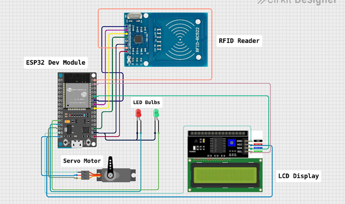
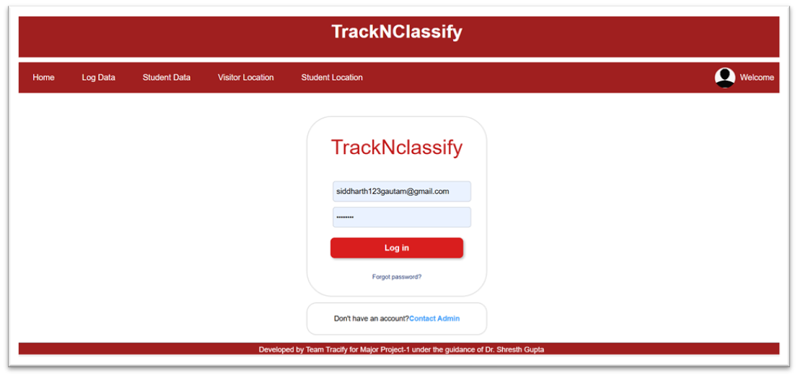
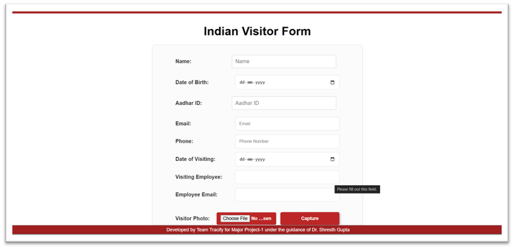
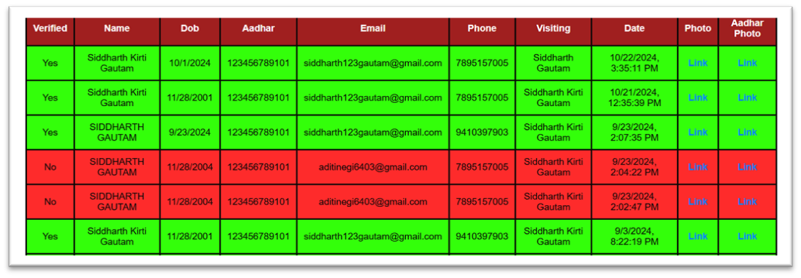
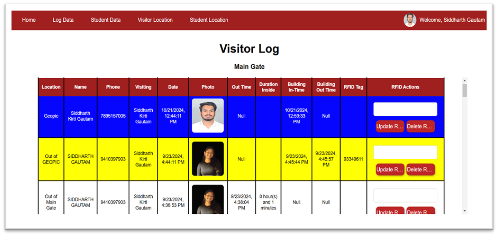

## Introduction:

TrackNClassify addresses growing concerns around organizational security by leveraging modern technologies. The system integrates image recognition (face recognition), QR code scanning, and RFID technology to provide multilayered authentication, ensuring only authorized individuals can access the premises.

By combining biometric sensors, smart cards, and mobile applications, the system offers real-time monitoring, logging, and security breach detection. 
Built using the MERN stack (MongoDB, Express.js, React, Node.js), this project aims to provide robust security while streamlining access control management.

## Problem Statement:

Traditional security systems, such as ID cards or manual logbooks, are often susceptible to fraud, forgery, and inefficiency. They lack real-time monitoring, leading to delays in identifying and addressing security breaches. This project aims to overcome these limitations by integrating multiple authentication mechanisms, offering robust and scalable security for modern organizations.

## Objectives:
The primary goals of this project include:

- **Multifaceted Authentication**: Implementing a combination of image recognition, RFID, and QR codes.
- **Database Integration**: Seamless integration with MongoDB for managing user data and logs.
- **Real-time Data Processing**: Immediate detection of unauthorized access through real-time data handling.
- **User-friendly Interface**: Developing a React-based interface for easy monitoring and management.
- **Comprehensive Logging**: Maintaining detailed logs to track movements and detect potential breaches.

### Features:
- **Biometric Authentication**: Face recognition for precise and secure access.
- **QR Code Scanning**: Temporary visitor access using dynamic QR codes.
- **RFID Integration**: Efficient authentication for employees and visitors using RFID cards.
- **Real-time Monitoring**: Immediate detection of unauthorized access attempts.
- **Centralized Logs**: Detailed entry/exit records stored in a MongoDB database.
- **React-based Dashboard**: Intuitive interface for security personnel.

## Methodology:
- Requirement Gathering: Identify hardware (biometric sensors, RFID readers, microcontrollers) and software (MERN stack components).
- System Design: Full-stack architecture using the MERN stack.

### Implementation:
- QR Code Scanning: Enable dynamic QR code generation and scanning.
- RFID Integration: Link RFID tags to employee/visitor data.
- Node-Mailer Integration: Use Node.js to manage email notifications.
- Database Setup: Configure MongoDB for logs and user data.
- Front-end Development: Build a React-based interface.
- Testing and Validation: Conduct unit and integration testing.
- Deployment and Monitoring: Deploy the system on a cloud platform for real-time synchronization.

## System Requirements:

- **Software**
  - MongoDB: Database management for logs and user data.
  - Express.js: Backend framework to manage server-side functionality.
  - React: Front-end library for user interface development.
  - Node.js: JavaScript runtime for building the back end.
  - CSS: Styling language for the user interface.
  - Arduino IDE: For programming the microcontroller.

- **Hardware**

  - RFID Reader: For scanning RFID tags.
  - ESP32 Microcontroller: To integrate hardware components with the server and database.
  - Cameras: For QR code scanning and face recognition.
  - RFID Tags: To link visitor data.
  - Server: Laptop/PC for hosting the application.

## Results:

